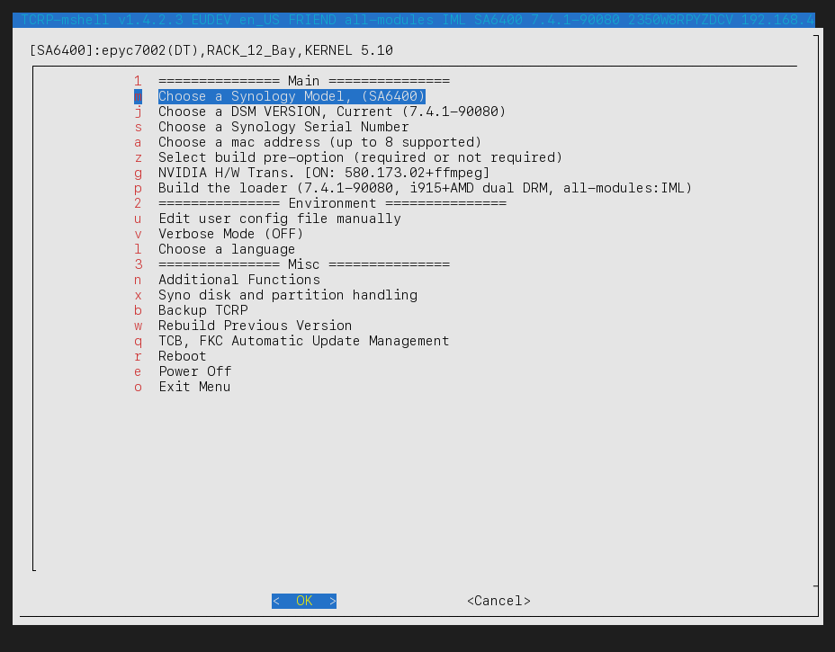
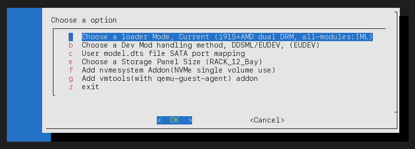
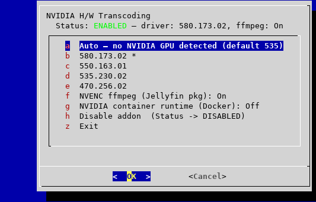
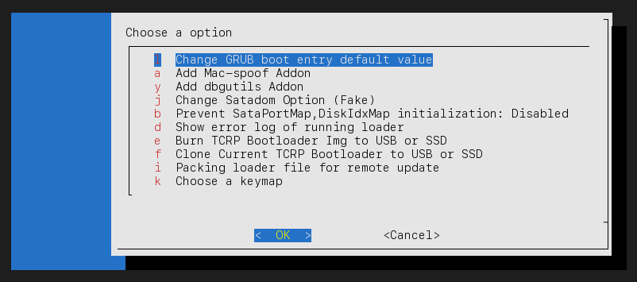
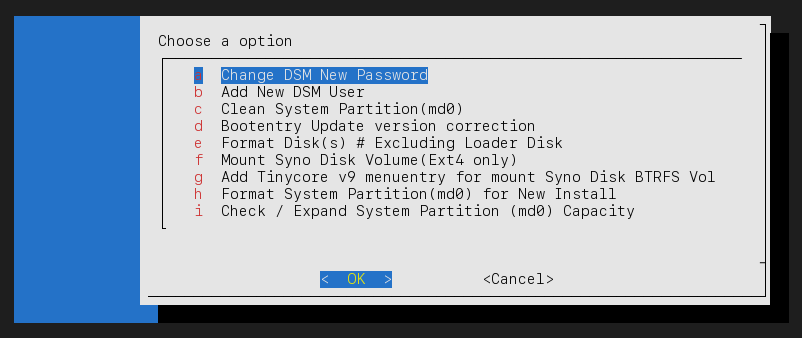
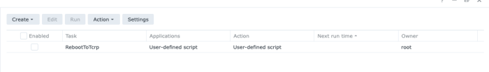
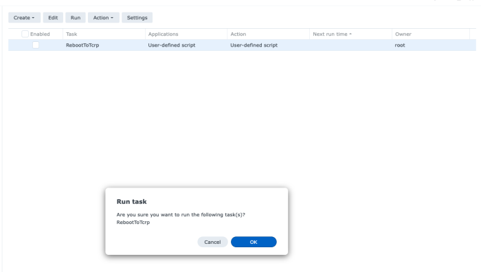
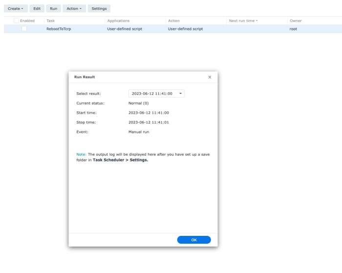

# M Shell for alpine-redpill

<a href="https://github.com/PeterSuh-Q3/alpine-redpill/releases"></a>

[](https://github.com/sponsors/PeterSuh-Q3)
<!-- [](https://user-badge.committers.top/south_korea/PeterSuh-Q3) -->

https://paypal.me/PeterSuhQ3


# Instructions

_[한국어 안내는 여기](README_instruction_ko.md)_

A typical build process starts with:

1. Burn images

    A. To burn physical gunzip and img files to a USB stick

    B. For virtual gunzip use the provided vmdk file

2. Boot alpine — `menu.sh` starts automatically and shows the main menu below.

All screenshots below are real captures taken from a live build (SA6400 / epyc7002, DSM 7.4.1-90080), running English (`en_US`).

## Main Menu

The main menu is grouped into three sections. Selecting a section header (`1`, `2`, `3`) just jumps the cursor to that section's first item — it isn't a separate screen. The title bar always shows the current loader version, dev-mod handling (DDSML/EUDEV), language, loader mode, module pack, model, DSM build, serial, IP, MAC address(es), and storage panel size.



Section 1 (`Main`) only shows item `c` before a model is picked — every other build-workflow item needs a model selected first.

### Section 1 — Main (the build workflow, follow top to bottom)

| Key | Item | What it does |
|---|---|---|
| `c` | Choose a Dev Mod handling method, DDSML/EUDEV | Only shown before a model is picked. Switches between DDSML (static, per-model module loading) and EUDEV (enhanced userspace device detection) — this choice affects which model list appears next, so it's the very first decision. |
| `m` | Choose a Synology Model | Opens the model picker (filtered by platform group / DT vs non-DT / after-Haswell support). Selecting a model resets the module pack to `all-modules` unless the platform requires otherwise, and — for BMI2-less CPUs on a kernel-5.10.55 platform — automatically caps a stale stored DSM version down to the newest one that still has a BMI2-free `custom-modules` build (≤ 7.3.2). |
| `j` | Choose a DSM VERSION | Lists up to 12 revisions for the selected model, newest first, pulled live from `pats.json`. On a BMI2-less CPU (kernel-5.10.55 platforms only), DSM 7.4.0+ entries are filtered out since neither `all-modules` (needs BMI2) nor `custom-modules` (only built through 7.3.2) can boot there. |
| `s` | Choose a Synology Serial Number | Generate a random serial or enter a real one. Required before building. |
| `a` | Choose a mac address (up to 8 supported) | Opens a submenu listing every present NIC (`a`–`h`); picking one lets you use the real MAC, generate a random one, or type one in. With only one NIC it skips straight to the address picker. |
| `z` | Select build pre-option | Submenu covering the loader mode, DDSML/EUDEV, DTS mapping, SATA-port remap, storage panel size, and two addon toggles — see [below](#z--select-build-pre-option). |
| `g` | NVIDIA H/W Trans. | Only shown on kernel 5.10.55/4.4 platforms (kernel 3.10 shows `(Not Supported)` and can't be entered, kernel 3.x hides the item entirely). Driver version, optional NVENC ffmpeg, and addon enable/disable — see [below](#g--nvidia-hw-transcoding). |
| `p` | Build the loader | Runs the actual build with everything selected above. The label always shows the current DSM build, DRM mode, and module pack so you can sanity-check before committing. |
| `y` | Boot the loader | Only shown once a FRIEND-mode loader has already been built (`FRKRNL=YES`) — boots straight into it without rebuilding. |

### Section 2 — Environment

| Key | Item | What it does |
|---|---|---|
| `u` | Edit user config file manually | Opens `user_config.json` directly in an editor for advanced/manual tweaks that don't have a dedicated menu yet. |
| `v` | Verbose Mode | Toggles extra build/runtime logging on or off; current state is shown in the label. |
| `l` | Choose a language | Switches the menu's display language (18 languages supported). |

### Section 3 — Misc

| Key | Item | What it does |
|---|---|---|
| `n` | Additional Functions | Submenu for loader-side maintenance and extras (GRUB default entry, addons, SATADOM, error log, burn/clone, packing, keymap) — see [below](#n--additional-functions). |
| `x` | Syno disk and partition handling | Submenu for DSM-side disk/partition operations once a loader has booted DSM (password/user, `md0` cleanup, boot-entry repair, formatting, volume mounting) — see [below](#x--syno-disk-and-partition-handling). |
| `b` | Backup TCRP | Backs up the current loader state so it survives a reboot without needing a full rebuild. |
| `w` | Rebuild Previous Version | Re-downloads and rebuilds whichever loader version was in use before the current one, without walking through the whole model/version picker again. |
| `q` | TCB, FKC Automatic Update Management | Manages automatic-update settings for TCRP itself and for FKC (FriendConfig) style extensions. |
| `r` | Reboot | Reboots the loader environment (not DSM). |
| `e` | Power Off | Shuts the loader environment down. |
| `o` | Exit Menu | Leaves `menu.sh` and drops to a shell, without rebooting or powering off. |

## `z` — Select build pre-option



| Key | Item | What it does |
|---|---|---|
| `a` | Choose a loader Mode | FRIEND (current, most recently stabilized) vs Direct-Boot (the old pre-FRIEND way). Label shows the current DRM mode and module pack. |
| `b` | Choose a Dev Mod handling method, DDSML/EUDEV | Same DDSML/EUDEV switch as top-level `c`, reachable again here once a model is already selected. |
| `c` | User model.dts file SATA port mapping | Lets you supply/edit a custom `.dts` file for SATA port mapping on this model. |
| `d` | sata_remap processing for SataPort reordering | Reorders SATA ports as seen by DSM. **Hidden on DT (Device-Tree) platforms**, which don't support `sata_remap` — not shown in the screenshot above because this box (`epyc7002(DT)`) is a DT platform. |
| `e` | Choose a Storage Panel Size | Sets the drive-bay panel size DSM's Storage Manager displays (cosmetic only, e.g. `RACK_12_Bay`). |
| `f` | Add/Remove nvmesystem Addon | Enables using a single NVMe device as a standalone volume. Marked experimental/risky in-menu; a confirmation warning is shown before enabling. |
| `g` | Add/Remove vmtools addon | Bundles `qemu-guest-agent` support for virtualized deployments. |
| `z` | exit | Returns to the main menu. |

## `g` — NVIDIA H/W Transcoding



The no-auth NVIDIA driver (physical/passthrough GPUs only — no vGPU, no license server) submenu. It resolves what to offer from the live driver catalog, so it only ever lists versions that actually exist for the current platform **and** kernel (kernel 5.10.55: 470/535/550/580; kernel 4.4: 550 only — NVIDIA's own floor; kernel 3.10: not enterable at all).

| Key | Item | What it does |
|---|---|---|
| `a` | Auto | Let the loader auto-detect and pick a suitable driver at build time (falls back to a safe default, e.g. 535, if no GPU is detected yet). |
| `b`–`e` | Specific driver versions (e.g. `580.173.02`, `550.163.01`, `535.230.02`, `470.256.02`) | Pin an exact driver version. The currently-active one is marked with `*`. On Ada/Blackwell cards, 580 is quietly not recommended (GSP firmware for those isn't in NVIDIA's `.run`) — pick 550 there instead. |
| `f` | NVENC ffmpeg (Jellyfin pkg) | Toggle bundling an NVENC-capable ffmpeg build alongside the driver. When enabled, a boot hook automatically repoints the SynoCommunity Jellyfin package's `--ffmpeg` argument at this build instead of the stock (non-NVENC) `ffmpeg7` binary — no manual path change needed in the Jellyfin UI. |
| `g` | Disable addon | Turns the whole NVIDIA addon off; the main-menu label reverts to `NVIDIA H/W Trans. [OFF] - select to add`. |
| `z` | Exit | Returns to the main menu. |

## `n` — Additional Functions



Loader-side maintenance and extras — everything here runs against the *loader environment*, not a booted DSM.

| Key | Item | What it does |
|---|---|---|
| `l` | Change GRUB boot entry default value | Changes which GRUB menu entry boots by default. |
| `a` | Add/Remove Mac-spoof Addon | Toggles the MAC-spoof addon. |
| `y` | Add/Remove dbgutils Addon | Toggles the debug-utilities addon. |
| `j` | Change Satadom Option | Cycles the fake-SATADOM setting (Disable / Native / Fake). |
| `z` | Enable/Disable i915 module | Only shown on `geminilake(DT)`/`apollolake` — toggles the i915 kernel module. |
| `b` | Prevent SataPortMap,DiskIdxMap initialization | Toggles whether the loader is allowed to (re)initialize `SataPortMap`/`DiskIdxMap` on this model. |
| `d` | Show error log of running loader | Displays the current loader's error log. |
| `e` | Burn TCRP Bootloader Img to USB or SSD | Writes a fresh loader image to another disk (see `burnloader()`). |
| `f` | Clone Current TCRP Bootloader to USB or SSD | Clones the *currently running* loader (not a fresh download) to another disk. |
| `h` | Inject Bootloader to Syno DISK | Only shown in Direct-Boot mode (`FRKRNL=NO`) on non-DT epyc7002/epyc7003ntb/epyc7003/icelaked platforms — injects a bootloader partition directly onto a Synology data disk. |
| `m` | Remove the injected bootloader partition | Same visibility rule as `h` — removes an injected bootloader partition. |
| `i` | Packing loader file for remote update | Packages the loader for distribution/remote update. |
| `k` | Choose a keymap | Sets the console keyboard layout. |

## `x` — Syno disk and partition handling



DSM-side disk and partition operations — most of these are only meaningful once a loader has actually booted into DSM.

| Key | Item | What it does |
|---|---|---|
| `a` | Change DSM New Password | Resets the DSM admin password. |
| `b` | Add New DSM User | Creates a new DSM user account. |
| `c` | Clean System Partition(md0) | Cleans the DSM system partition. |
| `d` | Bootentry Update version correction | Fixes a mismatched/broken GRUB boot-entry version reference. |
| `e` | Format Disk(s) | Formats data disk(s), excluding the loader disk itself. |
| `f` | Mount Syno Disk Volume(Ext4 only) | Mounts an existing Synology Ext4 volume for inspection/recovery. |
| `g` | Add Tinycore v9 menuentry for mount Syno Disk BTRFS Vol | Adds a rescue GRUB entry that boots a TinyCore v9 environment for mounting a BTRFS volume. |
| `h` | Format System Partition(md0) for New Install | Formats `md0` in preparation for a fresh DSM install. |
| `i` | Check / Expand System Partition (md0) Capacity | Detects an undersized legacy `md0` (e.g. a 2.4GB partition that blocks a DSM 7.4 upgrade) and grows it to fill the partition. |

# < Caution >

Changepanelsize synology user must be granted the authority to process with sudoers.

Check if the file already exists with the command below, and if not,

sudoers processing as below is absolutely necessary.

If sudoers does not exist, panel size change will not be processed due to insufficient authority.


```
sudo -i
ll /etc/sudoers.d/Changepanelsize
```

```
sudo -i
echo "Changepanelsize ALL=(ALL) NOPASSWD: ALL" > /etc/sudoers.d/Changepanelsize
chmod 0440 /etc/sudoers.d/Changepanelsize
```

-------------------------------------------------------------------------------


### Please note that minimum recommended memory size for configuring the loader is 4GB


-------------------------------------------------------------------------------

 - Changing the GNU GRUB Boot Order without a Physical Keyboard (Reboot to TCRP)

1. You can change the GNU GRUB boot order by manually executing "RebootToTcrp" of the custom Task Scheduler

    (DSM > Control Panel > Task Scheduler) as shown below, without using a physical keyboard.

    After this execution, the GNU GRUB boot menu automatically enters "Tiny Core Image Build".

    (This function is provided only when using the latest version of M SHELL.)








2. You must be able to access TCRP Linux via SSH.

    The IP address is usually the same as the first IP assigned to DSM when using a real MAC address.

    For more secure processing, please assign the above real MAC address and a static IP to the router.


3. Connect to TCRP Linux with the information below through an SSH tool.

    userid   : tc
    password : P@ssw0rd


4. Run ./menu.sh to rebuild the loader.

-------------------------------------------------------------------------------

 - GitHub ACTIONS-COOL Loader Auto Build Feature Distribution (Using Issues)

1. You must have a GitHub account.

https://github.com/

Create an account with Sign Up and then log in with Sign In.

2. If you write an issue in this issue, the loader will be automatically built based on the model in the content you wrote.

https://github.com/PeterSuh-Q3/alpine-redpill/issues

This is using the GitHub ACTIONS-COOL build bot.


3. The title of the issue (the word custom must be included in the title.)

custom SA6400

The content of the main text is

{"model":"SA6400","version":"7.2.2-72806"}

Or

If you have a full-size serial and Mac address, please enter it in the following format. (Mac addresses are supported up to 4, mac4 only.)

{"model":"SA6400","version":"7.2.2-72806","mac1":"112233445566","mac2":"77889900aabb","sn":"1111222233333"}

If the Mac address and serial are omitted, they will be randomly generated.

You must write it in the form of a JSON body like this.

You can change the model and version, but if you make even the slightest mistake in spelling, the build will not be done properly.


4. Save the issue

If you go to the Actions side, you will see an orange icon and the loader build will proceed.

https://github.com/PeterSuh-Q3/alpine-redpill/actions

Workflow runs · PeterSuh-Q3/alpine-redpill
github.com
Contribute to PeterSuh-Q3/alpine-redpill development by creating an

If you want to see the details, you can click on the workflow in progress.

If the loader build is successful, the workflow will turn green.

If you select Summary,

The artifact result, which is the loader file generated at the very bottom, is saved in the form of a zip file.


In this MshellImage-*.zip, the img file and vmdk file are each recompressed in tgz format.

The core content of this function is

Originally, you burn the official img of the TCRP-mshell loader to USB,

Enter ./menu.sh, select the model, version, serial, MAC address, etc., and go through manual build to complete the loader,

but this function is a function that allows you to receive an already completed loader from GitHub, bake it, and use it.

Since the Grub boot menu is created in the same way as when you manually build,

you can also build the loader created in this way by entering the manual build menu again.

--------------------------------------------------------------------

