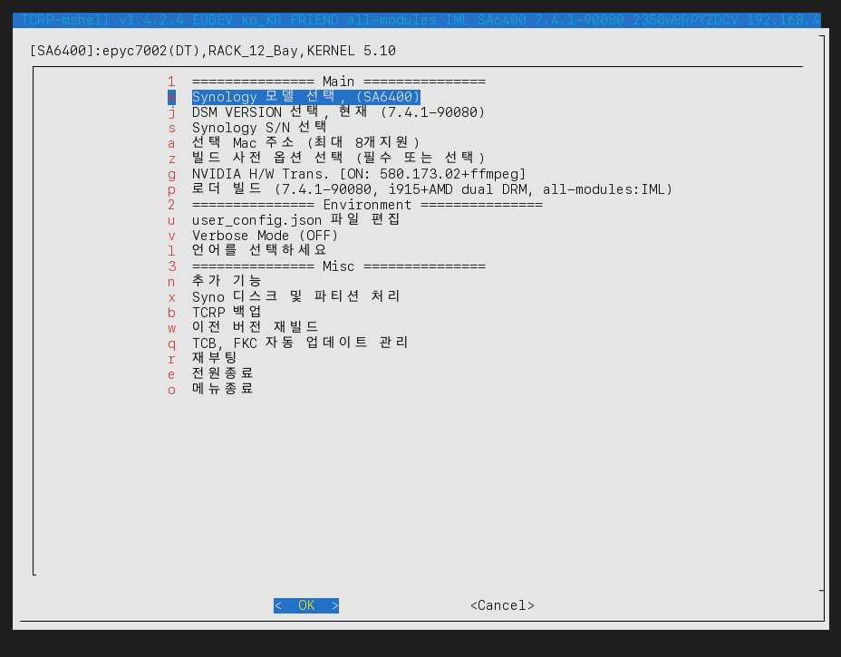
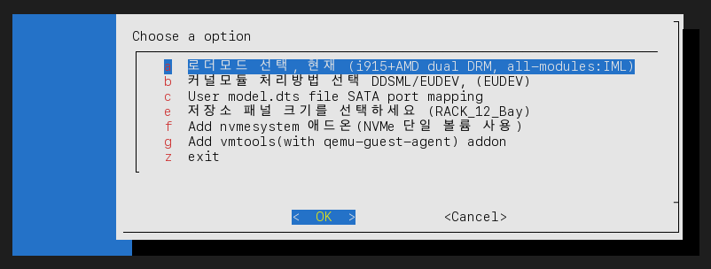
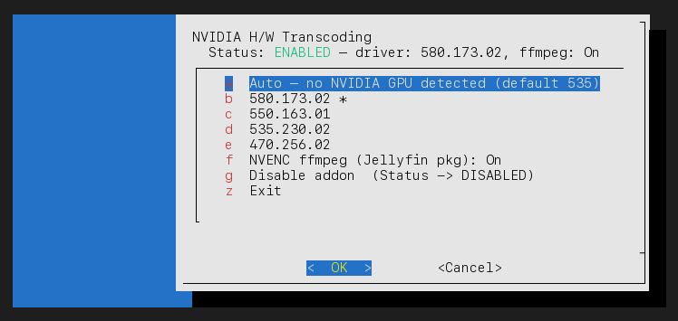
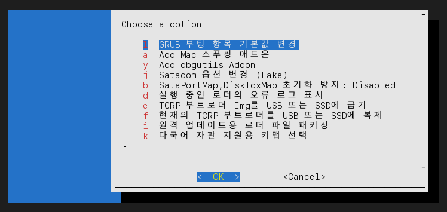
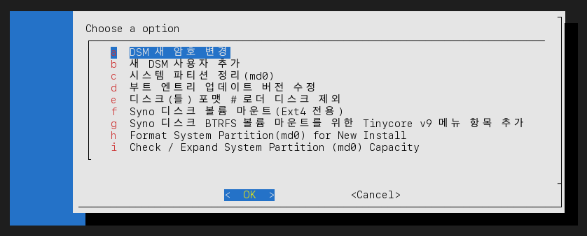

# 사용 안내 (Instructions, 한국어)

일반적인 빌드 과정은 다음과 같이 시작됩니다:

1. 이미지 굽기

    A. 실기(물리 USB)에는 압축 해제한 img 파일을 굽습니다

    B. 가상머신에는 제공되는 vmdk 파일을 사용합니다

2. Alpine 부팅 — `menu.sh`가 자동으로 실행되며 아래와 같은 메인 메뉴가 나타납니다.

아래 캡처는 실제 실기(SA6400 / epyc7002, DSM 7.4.1-90080)에서 언어를 한국어(`ko_KR`)로 전환한 뒤 직접 캡처한 화면입니다.

## 메인 메뉴

메인 메뉴는 3개 섹션으로 구분되어 있습니다. 섹션 헤더(`1`, `2`, `3`)를 선택하면 해당 섹션의 첫 항목으로 커서만 이동할 뿐, 별도 화면으로 넘어가지는 않습니다. 상단 타이틀바에는 항상 로더 버전, DEV MOD 처리 방식(DDSML/EUDEV), 언어, 로더 모드, 모듈팩, 모델, DSM 빌드, 시리얼, IP, MAC 주소, 저장소 패널 크기가 표시됩니다.

모델을 아직 선택하지 않은 상태에서는 섹션 1(`Main`)에 `c` 항목만 표시됩니다 — 그 외 모든 빌드 워크플로 항목은 모델 선택이 먼저 필요합니다.

### 섹션 1 — Main (빌드 워크플로, 위에서 아래 순서로 진행)

| 키 | 항목 | 설명 |
|---|---|---|
| `c` | 커널모듈 처리방법 선택 DDSML/EUDEV | 모델을 선택하기 전에만 표시됩니다. DDSML(모델별 정적 모듈 로딩)과 EUDEV(향상된 사용자공간 장치 감지) 중 하나를 선택합니다 — 이 선택에 따라 다음에 뜨는 모델 목록이 달라지므로 가장 먼저 결정해야 합니다. |
| `m` | Synology 모델 선택 | 모델 선택 화면을 엽니다(플랫폼 그룹 / DT·비DT / after-Haswell 지원 여부로 필터링됨). 모델을 선택하면 플랫폼이 별도로 요구하지 않는 한 모듈팩이 `all-modules`로 초기화되고, BMI2 미지원 CPU + 커널 5.10.55 플랫폼인 경우 저장된 DSM 버전이 오래돼 있으면 BMI2 없이도 `custom-modules`가 빌드되는 최신 버전(≤ 7.3.2)으로 자동 보정됩니다. |
| `j` | DSM VERSION 선택 | 선택한 모델에 대해 `pats.json`에서 실시간으로 가져온 리비전을 최신순 최대 12개까지 표시합니다. BMI2 미지원 CPU(커널 5.10.55 플랫폼에 한함)에서는 DSM 7.4.0 이상 항목이 제외됩니다 — `all-modules`는 BMI2가 필요하고 `custom-modules`는 7.3.2까지만 빌드되어 있어 둘 다 부팅이 안 되기 때문입니다. |
| `s` | Synology S/N 선택 | 시리얼 번호를 무작위로 생성하거나 직접 입력합니다. 빌드 전 필수입니다. |
| `a` | 선택 Mac 주소 (최대 8개지원) | 현재 존재하는 모든 NIC(`a`~`h`)을 나열하는 하위메뉴를 엽니다. 각 NIC마다 실제 MAC 주소 사용, 무작위 생성, 직접 입력 중 선택할 수 있습니다. NIC이 1개뿐이면 목록 없이 바로 주소 선택 화면으로 진입합니다. |
| `z` | 빌드 사전 옵션 선택 | 로더 모드, DDSML/EUDEV, DTS 매핑, SATA 포트 리맵, 저장소 패널 크기, 애드온 토글 2종을 다루는 하위메뉴입니다 — [아래](#z--빌드-사전-옵션-선택) 참고. |
| `g` | NVIDIA H/W Trans. | 커널 5.10.55/4.4 플랫폼에서만 표시됩니다(커널 3.10은 `(Not Supported)`로 표기되고 진입 자체가 막히며, 커널 3.x는 항목 자체가 숨겨집니다). 드라이버 버전, NVENC ffmpeg 선택, 애드온 활성화/비활성화 — [아래](#g--nvidia-hw-transcoding) 참고. |
| `p` | 로더 빌드 | 위에서 선택한 내용으로 실제 빌드를 실행합니다. 라벨에 항상 현재 DSM 빌드, DRM 모드, 모듈팩이 표시되므로 실행 전에 확인할 수 있습니다. |
| `y` | Boot the loader | FRIEND 모드 로더가 이미 빌드된 경우(`FRKRNL=YES`)에만 표시되며, 재빌드 없이 바로 그 로더로 부팅합니다. |

### 섹션 2 — Environment

| 키 | 항목 | 설명 |
|---|---|---|
| `u` | user_config.json 파일 편집 | 전용 메뉴가 아직 없는 고급/수동 조정을 위해 `user_config.json`을 직접 편집기로 엽니다. |
| `v` | Verbose Mode | 추가 빌드/런타임 로그 출력을 켜고 끕니다. 현재 상태가 라벨에 표시됩니다. |
| `l` | 언어를 선택하세요 | 메뉴 표시 언어를 전환합니다(18개 언어 지원). (※ 위 캡처 화면에는 이 문구가 수정 전 "언어를 선택하세요(Choose a lageuage)"로 보이는데, 이후 오탈자를 제거했습니다 — 최신 빌드에서는 "언어를 선택하세요"로만 표시됩니다.) |

### 섹션 3 — Misc

| 키 | 항목 | 설명 |
|---|---|---|
| `n` | 추가 기능 | GRUB 기본 항목, 애드온, SATADOM, 오류 로그, 굽기/복제, 패키징, 키맵 등 로더 측 유지보수/부가기능 하위메뉴입니다 — [아래](#n--추가-기능) 참고. |
| `x` | Syno 디스크 및 파티션 처리 | 로더가 DSM으로 부팅된 이후의 DSM 측 디스크/파티션 작업(암호/사용자, `md0` 정리, 부트 엔트리 복구, 포맷, 볼륨 마운트) 하위메뉴입니다 — [아래](#x--syno-디스크-및-파티션-처리) 참고. |
| `b` | TCRP 백업 | 전체 재빌드 없이도 재부팅 후 살아남도록 현재 로더 상태를 백업합니다. |
| `w` | Rebuild Previous Version | 모델/버전 선택 과정을 다시 거치지 않고, 직전에 사용하던 로더 버전을 다시 내려받아 재빌드합니다. |
| `q` | TCB, FKC Automatic Update Management | TCRP 자체와 FKC(FriendConfig) 계열 확장의 자동 업데이트 설정을 관리합니다. |
| `r` | 재부팅 | 로더 환경을 재부팅합니다(DSM이 아님). |
| `e` | 전원종료 | 로더 환경을 종료합니다. |
| `o` | 메뉴종료 | 재부팅이나 전원 종료 없이 `menu.sh`를 종료하고 셸로 빠집니다. |

## `z` — 빌드 사전 옵션 선택

| 키 | 항목 | 설명 |
|---|---|---|
| `a` | 로더모드 선택, 현재 (...) | FRIEND(현재 방식, 가장 최근에 안정화됨) vs Direct-Boot(FRIEND 이전의 옛 방식). 라벨에 현재 DRM 모드와 모듈팩이 함께 표시됩니다. |
| `b` | 커널모듈 처리방법 선택 DDSML/EUDEV | 최상위 `c`와 동일한 DDSML/EUDEV 전환 항목으로, 모델이 이미 선택된 상태에서 여기서도 다시 바꿀 수 있습니다. |
| `c` | User model.dts file SATA port mapping | 이 모델의 SATA 포트 매핑용 커스텀 `.dts` 파일을 지정/편집합니다. |
| `d` | sata_remap processing for SataPort reordering | DSM이 인식하는 SATA 포트 순서를 재배치합니다. **DT(Device-Tree) 플랫폼에서는 숨겨집니다** — `sata_remap`을 지원하지 않기 때문입니다. 위 캡처의 박스(`epyc7002(DT)`)가 DT 플랫폼이라 화면에 보이지 않습니다. |
| `e` | 저장소 패널 크기를 선택하세요 | DSM Storage Manager에 표시되는 드라이브 베이 패널 크기를 설정합니다(예: `RACK_12_Bay`, 순전히 화면 표시용). |
| `f` | Add nvmesystem 애드온 | 단일 NVMe 장치를 단독 볼륨으로 사용할 수 있게 합니다. 메뉴 내에서 실험적/위험 기능으로 표시되며, 활성화 전 확인창이 뜹니다. |
| `g` | Add vmtools(with qemu-guest-agent) addon | 가상화 환경 배포를 위한 `qemu-guest-agent` 지원을 번들로 추가/제거합니다. |
| `z` | exit | 메인 메뉴로 돌아갑니다. |

## `g` — NVIDIA H/W Transcoding

무인증 NVIDIA 드라이버(물리/passthrough GPU 전용 — vGPU·라이선스 서버 없음) 하위메뉴입니다. 실시간 드라이버 카탈로그를 기준으로 항목을 구성하므로, 현재 플랫폼**과** 커널에 실제로 존재하는 버전만 표시됩니다(커널 5.10.55: 470/535/550/580, 커널 4.4: 550만 — NVIDIA 자체 하한선, 커널 3.10: 진입 자체 불가). 이 하위메뉴는 아직 한국어로 번역되지 않았습니다.

| 키 | 항목 | 설명 |
|---|---|---|
| `a` | Auto | 빌드 시점에 로더가 자동으로 적합한 드라이버를 감지/선택하게 합니다(아직 GPU가 감지되지 않은 경우 535 등 안전한 기본값으로 대체). |
| `b`~`e` | 개별 드라이버 버전(`580.173.02`, `550.163.01`, `535.230.02`, `470.256.02` 등) | 특정 드라이버 버전을 고정합니다. 현재 적용 중인 버전에는 `*` 표시가 붙습니다. Ada/Blackwell 카드에서는 580이 조용히 추천 목록에서 빠집니다(해당 카드용 GSP 펌웨어가 NVIDIA `.run`에 없음) — 이 경우 550을 선택하세요. |
| `f` | NVENC ffmpeg (Jellyfin pkg) | NVENC 지원 ffmpeg 빌드를 드라이버와 함께 번들할지 켭니다/끕니다. 켜두면 부팅훅이 SynoCommunity Jellyfin 패키지의 `--ffmpeg` 인자를 기본(비NVENC) `ffmpeg7` 바이너리 대신 이 빌드로 자동 재지정합니다 — Jellyfin UI에서 경로를 수동으로 바꿀 필요가 없습니다. |
| `g` | Disable addon | NVIDIA 애드온 전체를 끕니다. 메인 메뉴 라벨이 `NVIDIA H/W Trans. [OFF] - select to add`로 돌아갑니다. |
| `z` | Exit | 메인 메뉴로 돌아갑니다. |

## `n` — 추가 기능

로더 측 유지보수/부가기능입니다 — 여기의 모든 항목은 *부팅된 DSM*이 아니라 *로더 환경* 자체에 대해 동작합니다.

| 키 | 항목 | 설명 |
|---|---|---|
| `l` | GRUB 부팅 항목 기본값 변경 | 기본으로 부팅될 GRUB 메뉴 항목을 변경합니다. |
| `a` | Add Mac 스푸핑 애드온 | Mac-spoof 애드온을 추가/제거합니다. |
| `y` | Add dbgutils Addon | 디버그 유틸리티 애드온을 추가/제거합니다. |
| `j` | Change Satadom Option (Fake) | 가짜 SATADOM 설정을 순환합니다(Disable / Native / Fake). |
| `z` | Enable/Disable i915 module | `geminilake(DT)`/`apollolake`에서만 표시되며 i915 커널 모듈을 켜고 끕니다. |
| `b` | SataPortMap,DiskIdxMap 초기화 방지 | 이 모델에서 로더가 `SataPortMap`/`DiskIdxMap`을 (재)초기화하도록 허용할지 여부를 전환합니다. |
| `d` | 실행 중인 로더의 오류 로그 표시 | 현재 로더의 오류 로그를 보여줍니다. |
| `e` | TCRP 부트로더 Img를 USB 또는 SSD에 굽기 | 다른 디스크에 새 로더 이미지를 씁니다(`burnloader()`). |
| `f` | 현재의 TCRP 부트로더를 USB 또는 SSD에 복제 | 새로 내려받는 대신 *지금 실행 중인* 로더 그대로를 다른 디스크에 복제합니다. |
| `h` | Inject Bootloader to Syno DISK | Direct-Boot 모드(`FRKRNL=NO`)이고 비DT epyc7002/epyc7003ntb/epyc7003/icelaked 플랫폼일 때만 표시됩니다 — Synology 데이터 디스크에 부트로더 파티션을 직접 주입합니다. |
| `m` | Remove the injected bootloader partition | `h`와 동일한 노출 조건이며, 주입된 부트로더 파티션을 제거합니다. |
| `i` | 원격 업데이트용 로더 파일 패키징 | 배포/원격 업데이트용으로 로더를 패키징합니다. |
| `k` | 다국어 자판 지원용 키맵 선택 | 콘솔 키보드 레이아웃을 설정합니다. |

## `x` — Syno 디스크 및 파티션 처리

DSM 측 디스크/파티션 작업입니다 — 대부분 로더가 실제로 DSM까지 부팅된 이후에만 의미가 있습니다.

| 키 | 항목 | 설명 |
|---|---|---|
| `a` | DSM 새 암호 변경 | DSM 관리자 암호를 재설정합니다. |
| `b` | 새 DSM 사용자 추가 | 새 DSM 사용자 계정을 생성합니다. |
| `c` | 시스템 파티션 정리(md0) | DSM 시스템 파티션을 정리합니다. |
| `d` | 부트 엔트리 업데이트 버전 수정 | 어긋나거나 깨진 GRUB 부트 엔트리 버전 참조를 고칩니다. |
| `e` | 디스크(들) 포맷 | 로더 디스크를 제외한 데이터 디스크(들)을 포맷합니다. |
| `f` | Syno 디스크 볼륨 마운트(Ext4 전용) | 기존 Synology Ext4 볼륨을 점검/복구용으로 마운트합니다. |
| `g` | Syno 디스크 BTRFS 볼륨 마운트를 위한 Tinycore v9 메뉴 항목 추가 | BTRFS 볼륨 마운트를 위해 TinyCore v9 환경으로 부팅하는 구조용 GRUB 항목을 추가합니다. |
| `h` | Format System Partition(md0) for New Install | 새 DSM 설치를 위해 `md0`를 포맷합니다. |
| `i` | Check / Expand System Partition (md0) Capacity | 용량이 작은 레거시 `md0`(예: DSM 7.4 업그레이드를 막는 2.4GB 파티션)를 감지해 파티션 전체 크기로 확장합니다. |
